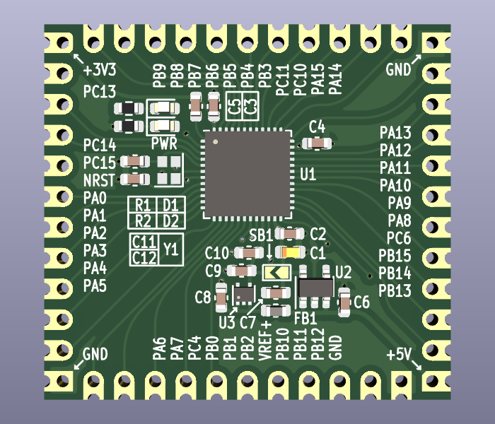

# STM32G491CCUx Adaptor PCB

Adaptor PCB for STM32G491CCUx. Contains 20MHz crystal oscillator, power and user LED and separate 3.3V voltage regulators both for digital and analog part. It is possible to use only one voltage regulator or a direct 3.3V supply, in which case it is mandatory to close the SB1 solderbridge.

All free pins are routed to the edge of the board.

